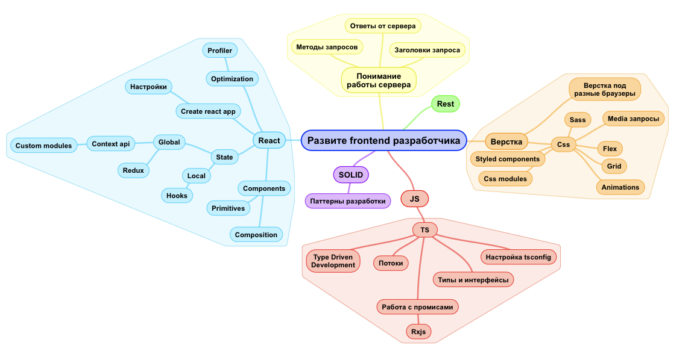
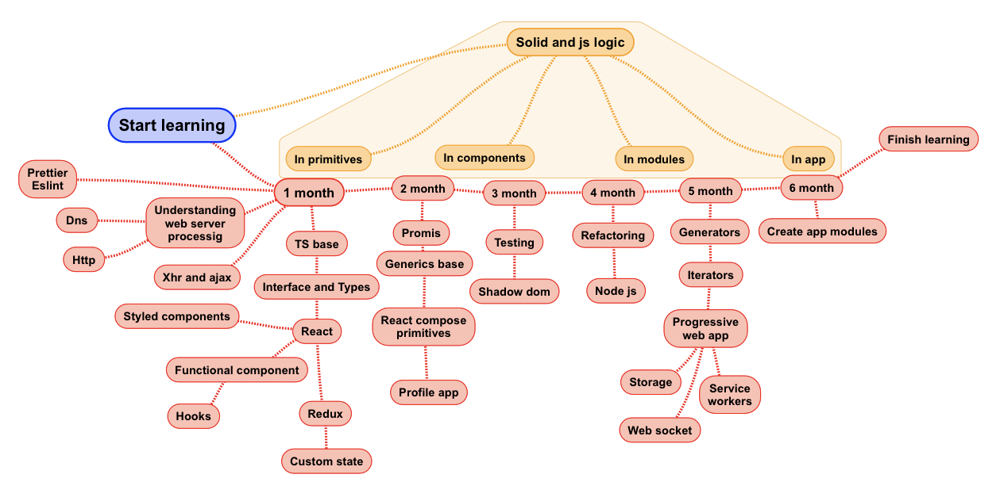

# Обучение Frontend разработке по шагам

После того, как вы завершите программу по этому учебному плану, вы получите общее представление о каждой из представленных в ней тем, и в дальнейшем сможете углубиться в любую из них при необходимости.

Любой процесс познания можно представить в виде буквы «Т», где горизонтальная линия — широкое понимание, вертикальная — глубокое. У идеального специалиста буква Т большая и красивая, равномерная. Если она вытянута в одну сторону, она некрасива, уродлива; такой специалист мало полезен в боевых делах. Он может либо глубоко разбираться в чём-то одном, но чуть шаг в сторону, и он непригоден; либо поверхностно разбираться во всём, но при этом ничего не уметь. В первую очередь необходимо максимально развить широкую составляющую, чем мы сейчас и займёмся — постараемся максимально широко охватить все аспекты фронтенда, не углубляясь. А потом вы займётесь углублением, которое останется вам на самостоятельную работу.

Для лучшего понимания объемов материала можно взглянуть на следующую диаграмму.

А в связке с процессом обучения поможет разобраться эта диаграмма:

Теперь можно описать шаги обучения подробнее в разрезе месяцов:

1. Первый месяц
    1. [Понимание работы web сервера](1m/web-server.md)
    2. [Xml Http Request (XHR) или AJAX запросы](1m/ajax.md)
    3. Базовые знания [JS](https://learn.javascript.ru/) и [TS](http://typescript-lang.ru/docs/)
    4. [Введение в React TS](1m/reactBeginner.md)
    5. [Что такое и зачем нужен SOLID](https://medium.com/webbdev/solid-4ffc018077da)
    6. Примитивы в React
    7. SOLID для примитивов в React
    8. [Styled components](https://www.styled-components.com/)
2. Второй месяц
    1. [Введение в дженерики в TS (En)](https://www.typescriptlang.org/docs/handbook/generics.html)
    2. Работа с [Promise](https://learn.javascript.ru/promise) и введение в [Rx.js](https://habr.com/ru/post/438642/)
    3. Выявление примитивов и использование их в компонентах React
    4. Знакомство с инструментами профилирования React
    5. [Redux](https://medium.com/devschacht/redux-step-by-step-e6c42a9b00cd) и [Context Api](https://reactjs.org/docs/context.html)
3. Третий месяц
    1. Тестирование
        1. Виды тестирование
        2. Инструменты тестирования
    2. Shadow dom
4. Четвертый месяц
    1. Refactoring и как не сломать работающее приложение
    2. Дженерики в TS
5. Пятый месяц
    1. Иттераторы TS
    2. Генераторы TS
    3. Web sockets
    4. PWA - Progressive Web Application
6. Шестой месяц
    1. Service workers
    2. Infinity scroll
